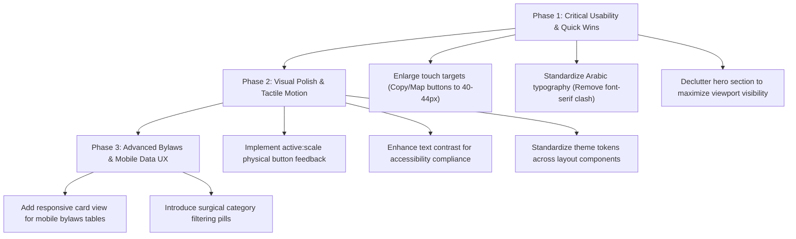

# UI/UX Expert Evaluation & Audit Report
## Medical Care & Network Directory 2026 (Med Aggregator / Tabeebk)

---

## 1. Design Read & Contextual Persona

> **Design Read:** A public service and healthcare welfare directory for Egyptian Customs & Taxes employees, retirees, and their families. Built with a Trust-First, High-Accessibility mandate in Arabic (RTL) using Next.js 15, React 19, Tailwind CSS, and the Cairo typeface.

* **Target Audience:** Healthcare fund members across diverse age groups (active civil servants, elderly retirees, widows, and dependents).
* **Primary Use Case & Context:** 
  * Urgent or fast searches for hospitals, diagnostic labs, clinics, or specialized doctors across 23 Egyptian governorates on mobile devices.
  * Financial inquiries regarding contribution percentages, surgical maximum caps, and monthly chronic illness medications.
* **Non-Negotiable Design Priorities:**
  1. **Speed & Direct Access:** Instant 1-tap phone dialing and Google Maps navigation.
  2. **Arabic Typographic Legibility & Contrast:** Crisp font rendering for elderly users and varying eyesight.
  3. **Touch Ergonomics:** Generous hit targets (WCAG / Apple HIG $\ge$ 44x44px).
  4. **Cognitive Load Reduction:** Preventing visual clutter and badge overcrowding.

---

## 2. UI/UX Scorecard

| Dimension | Current Score | Status | Expert Assessment |
| :--- | :---: | :---: | :--- |
| **Information Architecture** | **8.5 / 10** | 🟢 Excellent | Clear separation between Global Directory, Medical Facilities, Doctors, and Bylaws. |
| **Responsiveness & Perceived Performance** | **8.5 / 10** | 🟢 Excellent | Effective use of debouncing, `AbortController`, and ISR prevents UI freezing during rapid searches. |
| **Visual Hierarchy & Theme Consistency** | **7.0 / 10** | 🟡 Good (Needs Polish) | Hardcoded color values (e.g. `bg-slate-900` in footer) conflict with design token variables; hero section has stacked announcements. |
| **Arabic Typography & Scanability** | **7.0 / 10** | 🟡 Good | `Cairo` is a strong font choice, but subtext sizes (<12px) and `font-serif` overrides on the Introduction page create visual friction. |
| **Micro-Interactions & Motion** | **6.5 / 10** | 🟠 Needs Enhancement | Absence of tactile `:active` physical feedback on interactive cards/buttons; motion curves need custom easings. |
| **Accessibility (WCAG AA Compliance)** | **7.5 / 10** | 🟡 Good | Most elements have proper ARIA attributes, but some muted text (`muted-foreground/60`) falls below the 4.5:1 contrast threshold. |

---

## 3. Core Architectural Strengths

1. **One-Tap Communication:** Seamless integration of single-tap phone dialers with a multi-number `PhoneActionSheet` modal and accurate Google Maps search URLs.
2. **Intelligent Arabic Parsing:** Automated title, specialty, and name extraction (`parseDoctorTitleAndSpecialty`) cleans up unstructured legacy database records into clear badge hierarchies.
3. **Interactive Bylaws Engine (`BylawsInteractiveSection`):** Digitizing static regulatory PDF schedules (surgical caps and chronic illness stipends) into searchable tables is a standout UX feature.
4. **Mobile Bottom Navigation (`MobileBottomNav`):** Dedicated thumb-friendly bottom bar with active filter badge indicators enables smooth single-handed mobile operation.

---

## 4. Heuristic Audit & Actionable Findings

### A. Emil Kowalski Interaction & Motion Review Table

| Element / Interaction | Before (Current Implementation) | After (Proposed Improvement) | UX Rationale |
| :--- | :--- | :--- | :--- |
| **Button & Card Press Feedback** | Only color change on hover or gentle `-translate-y-0.5` without press feedback. | Add `active:scale-[0.98] transition-transform duration-150` on all cards and buttons. | Simulates physical button depression, providing immediate reassurance that the interface acknowledged the tap. |
| **Dialogs & Sheet Transitions** | Standard centered expansion with default CSS timings. | Set origin-aware scaling on sheets and modals with a custom iOS-like curve: `cubic-bezier(0.32, 0.72, 0, 1)`. | Delivers a snappier, premium native app feel on mobile devices. |
| **Navbar Heart Icon Animation** | Continuous `animate-pulse` runs indefinitely in the header. | Trigger pulse only on hover or a single gentle pulse on initial mount, resting statically otherwise. | Perpetual movement in the header creates constant peripheral visual distraction while reading medical text. |
| **Mobile Filter Drawer Opening** | All filter options appear simultaneously without sequence. | Apply a subtle 30ms stagger between filter categories upon opening. | Guides the eye sequentially and elevates perceived interface craftsmanship. |

---

### B. Hero Section & Search Ergonomics

* **Problem (Clutter above the Fold):**
  * The homepage hero currently stacks 3 badges/pills (2026 Badge + Introduction Link + Bylaws Link) above the main headline. On mobile screens, this pushes the search input below the initial viewport.
* **Recommendation:**
  * Streamline the hero into a clean, focused search center:
    1. Single focused headline: **"ابحث في شبكة الرعاية الطبية 2026"**
    2. One concise value proposition sentence ($\le 20$ words).
    3. Prominent Search Bar with elevated soft shadow and focused ring glow.
    4. Quick facility filter pills directly below the search input.

---

### C. Card Anatomy & Mobile Touch Targets

* **Problem (Small Action Buttons in Address Row):**
  * In [doctor-card.tsx](file:///D:/freelance%20projects/Med%20Aggregator/components/doctors/doctor-card.tsx) and [provider-card.tsx](file:///D:/freelance%20projects/Med%20Aggregator/components/providers/provider-card.tsx), the copy address and Google Maps buttons are sized at `h-6 w-6` (24px).
  * **UX Risk:** 24px is too small for mobile touch targets (WCAG/Apple standard is 44x44px), resulting in accidental card-click triggers when users attempt to tap the map or copy icons.
* **Recommendation:**
  * Move secondary actions (Copy Address, Open Maps) to the card footer or increase hit target padding with an invisible target boundary (`min-h-[40px] min-w-[40px]`).

---

### D. Typography, Arabic Legibility & Theming

* **Font Uniformity on `/introduction`:**
  * The introduction letter uses `font-serif` on lines 48 & 61. Default browser Arabic serif fallbacks (e.g. Traditional Arabic / Times) clash with the modern sans-serif `Cairo` font used across the rest of the application.
  * **Fix:** Standardize on `Cairo` throughout, using typographic weight (`font-extrabold` / `font-bold`) and line height (`leading-relaxed`) for hierarchy instead of conflicting font families.
* **Footer Theme Tokens:**
  * [footer.tsx](file:///D:/freelance%20projects/Med%20Aggregator/components/layout/footer.tsx) hardcodes `bg-slate-900 text-slate-200` rather than leveraging theme variables (`bg-card` / `border-border`). Standardizing token usage ensures seamless light/dark mode parity.

---

### E. Bylaws & Financial Schedules Experience (`/bylaws`)

* **Mobile Table Display vs. Card Toggle:**
  * Wide financial tables currently rely on `overflow-x-auto`. On narrow phone displays, horizontal scrolling can feel cumbersome.
  * **Fix:** Introduce an automatic or switchable card layout on mobile where each surgical/chronic condition is displayed as an individual compact card with highlighted monetary caps.
* **Surgical Category Chips:**
  * Add quick category chips (Eye, Cardiology, Oncology, Surgery, Transplants, etc.) alongside the search input in `BylawsInteractiveSection` to allow 1-click filtering.

---

## 5. Prioritized Implementation Roadmap

### Phase 1: High Impact / Low Effort (Immediate Usability)
* Enlarge address action buttons (Copy & Maps) to meet accessibility touch standards.
* Replace `font-serif` on `/introduction` with native Cairo styling.
* Declutter hero badges to ensure the search bar and first results sit above the mobile fold.

### Phase 2: High Impact / Medium Effort (Polish & Micro-Interactions)
* Add `:active` tactile scaling and custom easing transitions to all interactive components.
* Ensure all muted text classes meet WCAG AA 4.5:1 contrast ratios.
* Align footer styling with global design system tokens.

### Phase 3: Medium Impact / Medium Effort (Feature & Data Ergonomics)
* Implement mobile card view alternatives for bylaws data tables.
* Add category filtering pills for surgical procedure caps.
